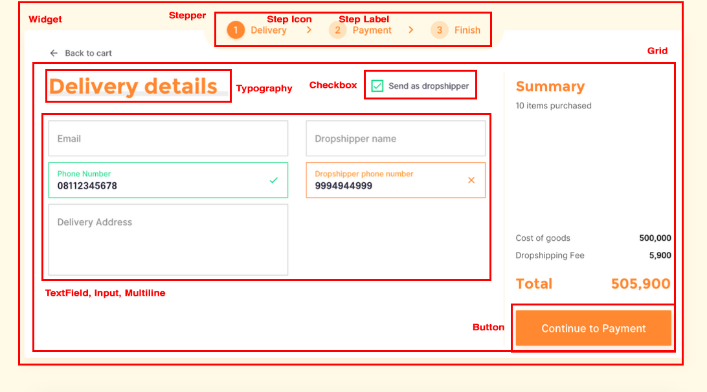

# CDD (Component Driven Development) in React
Component-Driven Development (CDD) is a development methodology that anchors the build process around components. It is a process that builds UIs from the “bottom up” by starting at the level of components and ending at the level of pages or screens.

Additionally, component-driven approach encourages design and development of components independently from the application's code. This leads to a better software architecture and can speed up the development process significantly due to a much shorter feedback loop. It encourages developers write reusable, modular components, and document them before even using in the application. 

## Components
- **[Stepper](src/components/Stepper)**, convey progress through numbered steps. It provides a wizard-like workflow.
- **[Step Icon](src/components/StepIcon)**, component support for Stepper, displayed any icon element
- **[Step Label](src/components/StepLabel/)**, component support for Stepper displayed text
- **[Input](src/components/InputBase/)**, component base for `<input />` element, integrated with react hook form `controller`
- **[Text Field](src/components/TextField/)**, let users enter and edit text
- **[Typography](src/components/Typography/)**, use typography to present your design and content as clearly and efficiently as possible
- **[Button](src/components/Button/)**, allow users to take actions, and make choices, with a single tap
- **[Checkbox](src/components/Checkbox/)**, allow the user to select one or more items from a set
- **[Grid](src/components/Grid/)**, responsive layout grid adapts to screen size and orientation, ensuring consistency across layouts
- **[Widget](src/components/Widget/)**, component serves as a wrapper component for most of the CSS utility needs

## Goals
One of the most important aspects for many businesses is scalability and maintainability.  Therefore, I made an approach using the CDD technique to create a React application that is modular, scalable, and easy-to-use.

## Libs
- [Styled Components](https://styled-components.com/)
- [React Hook Form](https://react-hook-form.com/)
- [useForkRef](https://react-hooks.org/docs/useForkRef)

## Roadmaps
Analyze what's needed -> Build UI Components -> Create Real Apps

## References
- [https://www.component-driven.dev/](https://www.component-driven.dev/)
- [https://mui.com/](https://mui.com/)